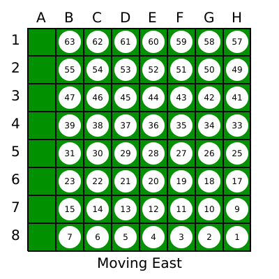

# Othello game engine in Rust
This is an experiment in order to build an Othello game engine in Rust, and later on to communicate with Javascript using WebAssembly.

A good reference for this experiment is https://www.hanshq.net/othello.html.

## Othello
See https://en.wikipedia.org/wiki/Reversi for game rules. These are very simple, but not straightforward when it comes to programming a game engine. 

## Bitboards
For board games like chess, checkers or othello, the board representation is usually called a `bitboard`. For Othello, because it's a 8x8 board dimension, black or white pieces (or disks) are kept using a 64-bits integer (`u64` type in Rust) for one player, with bits set to 1 for his/her pieces, and 0 for empty squares. Another bitboard is necessary to keep opposite color pieces.

It's a linear representation for the 8x8 board: the most significant bit is bit 63 and it's corresponding to the **A1** square, while the least significant bit 0 is **H8**:


NB: the Othello diagrams are created using my `SVGBoard` crate and converted to PNG using **Inkscape** with:

```command
$ inkscape -z -e empty_boardt.png -w 1024 -h 1024 empty_board.svg
```

It's generated by the following code:

```rust
// code is pretty self-explanatory
let mut svg = SVGBoard::new();

// write bit number from 63 down to 0
svg.draw_bit_indexes();
svg.draw_legend("Othello empty board");
svg.close();
svg.write("empty_board.svg");
```

I wrote that crate to better understand bitboard and move generations (see later).


It's interesting to note that if:
```rust
black: u64;     // bits set to '1' for occupied squares
white: u64;     // and to 0 for empty ones
```

then:

```rust
(black & white).count_zeros()
```

gives the number of empty squares (ref. to the **POPCNT** X64_64 assembly instruction).


## Moving all player's pieces at once
Because all pieces are kept using a single 64-bit integer, it's possible to move his/her disks using bit shifts and/or bit masking, depending on the possible 8 directions.

I first created a board full of white pieces, with:

```rust
let mut svg = SVGBoard::new();

// this draw all disks from a u64 value
svg.draw_pieces_from_u64(u64::max_value(), Color::White);
svg.draw_bit_indexes();
svg.draw_legend("Othello full board");
svg.close();
svg.write("full_board.svg");
```


### Moving South
Just shift to the right 8 times with:

```rust
// create brand new empty board
let mut svg = SVGBoard::new();    

// draw pieces depending on set bits in the u64 value
svg.draw_pieces_from_u64(u64::max_value() >> 8, Color::White);

// trick to keep track of the piece number
let mut v = VecInt64::new();
svg.draw_pieces_from_vecint64(v.rshift(8));

// add identification
svg.draw_legend("Moving South");

// write out file
svg.close();
svg.write(svg_file);
```


### Moving North
Just shift to the left 8 times with:

```rust
u64::max_value() << 8
```


### Moving East
Shift right once and mask with pattern **0b01111111** repeated 8 times:

```rust
(u64::max_value() >> 1) & 0b01111111_01111111_01111111_01111111_01111111_01111111_01111111_01111111
```




### Moving West
Shift left and mask with pattern **0b11111110** repeated 8 times:

```rust
(u64::max_value() << 1) & 0b11111110_11111110_11111110_11111110_11111110_11111110_11111110_11111110
```


### Moving South-East
Shift right 9 times and mask to get rid of first row and first column:

```rust
(u64::max_value() >> 9) & 0b00000000_01111111_01111111_01111111_01111111_01111111_01111111_01111111
```


### Moving South-West
Shift right 7 times and mask to get rid of last column:

```rust
(u64::max_value() >> 7) & 0b00000000_11111110_11111110_11111110_11111110_11111110_11111110_11111110
```


### Moving North-West
Shift left 9 times and mask to get rid of last column:

```rust
(u64::max_value() << 9) & 0b11111110_11111110_11111110_11111110_11111110_11111110_11111110_11111110
```


### Moving North-East
Shift left 7 times and mask to get rid of the first column:

```rust
(u64::max_value() << 7) & 0b01111111_01111111_01111111_01111111_01111111_01111111_01111111_01111111
```

